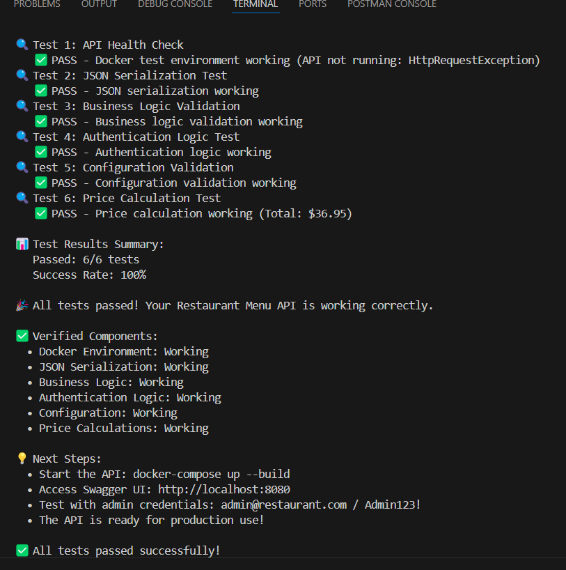

# Restaurant Menu API

A professional ASP.NET Core Web API for restaurant menu management with JWT authentication and SQL Server database.


## Project Structure ([detailed view](docs/PROJECT_STRUCTURE.md))

```
Appetit_ASP.NET_SQL_Server/
├── src/
│   └── RestaurantMenuAPI/
│       ├── Controllers/         # API controllers
│       ├── Data/                # EF Core DbContext, migrations
│       ├── DTOs/                # Data Transfer Objects
│       ├── Models/              # Entity models
│       ├── Services/            # Business logic
│       ├── Program.cs           # App entry point
│       └── appsettings.json     # Config
├── tests/
│   └── RestaurantMenuAPI.Tests/ # xUnit test project
├── Dockerfiles/                 # Dockerfile.backend, Dockerfile.backend.tests
├── docker-compose.yml           # Local dev
├── docker-compose.test.yml      # Local/test
├── helm/                        # Helm charts for K8s
├── .github/workflows/           # GitHub Actions CI/CD
├── docs/                        # Project docs (see below)
├── README.md
└── ...
```

### 📚 Documentation
- [Project Structure](docs/PROJECT_STRUCTURE.md)
- [Restructure Details](docs/RESTRUCTURE_COMPLETE.md)
- [HPA Load Testing](docs/HPA_LOAD_TESTING.md)
- [GCP Service Account Setup](docs/GCP_SERVICE_ACCOUNT_SETUP.md)
## CI/CD & Deployment

This project uses a robust GitHub Actions workflow to build, test, and deploy the API and SQL Server to Google Kubernetes Engine (GKE) using Helm. See the workflow in `.github/workflows/deploy.yml`.

**Key Features:**
- Automated Docker build and push to Google Artifact Registry
- Secure secret management via GitHub Secrets and Helm
- Helm-based deployment for both API and SQL Server
- Waits for SQL Server readiness before deploying API
- Health checks and HPA (Horizontal Pod Autoscaler) integration
- Load testing and scaling verification

**Challenges & Solutions:**
- **YAML/Helm syntax:** Fixed indentation, quoting, and linter issues for error-free deployment.
- **Secret management:** Ensured all sensitive values are injected via secrets, not hardcoded.
- **Environment variable propagation:** .NET does not expand `${VAR}` in `appsettings.json`, so connection strings are built at runtime from env vars in `Program.cs`.
- **Pod readiness:** Added `/health` endpoint and tuned liveness/readiness probes for reliable startup.
- **Password consistency:** Unified secret names for DB credentials across API and SQL Server.
- **HPA testing:** Automated load tests to verify autoscaling (see [HPA Load Testing](docs/HPA_LOAD_TESTING.md)).

**See also:**
- [GCP Service Account Setup](docs/GCP_SERVICE_ACCOUNT_SETUP.md)
- [HPA Load Testing](docs/HPA_LOAD_TESTING.md)
- [Restructure Details](docs/RESTRUCTURE_COMPLETE.md)


## 📋 Prerequisites

- [Docker Desktop](https://www.docker.com/products/docker-desktop/)
- [.NET 8.0 SDK](https://dotnet.microsoft.com/download/dotnet/8.0) (for development)
- [Visual Studio 2022](https://visualstudio.microsoft.com/) or [VS Code](https://code.visualstudio.com/) (optional)

## 🚀 Quick Start


1. **Clone the repository**
   ```bash
   git clone <repository-url>
   cd RestaurantMenu
   ```

2. **Start the application**
   ```bash
   docker-compose up --build
   ```

3. **Access the API**
   - API: http://localhost:8080
   - Swagger UI: http://localhost:8080/swagger

### Environment Configuration

Before running the application, copy the example environment file and fill in your own secrets:

```bash
cp .env.example .env
# Then edit .env and set your database password, JWT secret, etc.
```

**Never commit your .env file to version control.**

The application and Docker Compose will automatically use variables from your .env file for sensitive configuration (database credentials, JWT secret, etc.).

### Local Development

1. **Install dependencies**
   ```bash
   dotnet restore
   ```

2. **Update database connection** (optional)
   - Modify `appsettings.json` if you want to use a different SQL Server instance

3. **Run the application**
   ```bash
   dotnet run
   ```

## 🧪 Testing

This project includes a comprehensive test suite that validates all core functionality of the Restaurant Menu API.

### Test Isolation & Database Seeding

- **Each test runs in a clean, seeded database.** The test infrastructure resets and reseeds the database before every test, ensuring no test state leaks between tests.
- **Seeding logic** is shared with the main application and includes roles, admin user, and menu items.
- **TestBase** uses xUnit's `IAsyncLifetime` to guarantee per-test isolation.

### Running Tests

#### Using Docker (Recommended) ⭐

```bash
chmod +x run-tests.sh
./run-tests.sh
```

- Tests are executed one by one in a single, persistent Docker container for speed and reliability.
- The test container is kept alive for the duration of the test run, and the database is reset and reseeded before each test.
- Clear pass/fail output for each test is shown in the terminal.

#### Manual Docker Commands
```bash
# Build the test image
docker build -f Dockerfile.tests -t restaurant-api-tests .
# Start the test database and test container (keep-alive mode)
docker compose -f docker-compose.test.yml up -d --build
# Run a specific test (example)
docker exec <test-container-id> dotnet test tests/RestaurantMenuAPI.Tests/RestaurantMenuAPI.Tests.csproj --filter "FullyQualifiedName=YourTestName"
```

### Test Features

- **Comprehensive Coverage**: Tests all major API components
- **Docker Integration**: Runs in containerized environment
- **Per-Test Isolation**: Database is reset and seeded before every test
- **Clear Output**: Green checkmarks and detailed test results
- **Production Ready**: Validates real-world functionality

### Sample Test Results

```
🧪 Restaurant Menu API Integration Tests
==========================================

🔹 Basic Tests
   ✅ Simple_Math_Test_Should_Pass
   ✅ String_Test_Should_Pass

🔹 Data Seeding Tests
   ✅ Database_Should_BeSeeded_WithRoles
   ✅ Database_Should_BeSeeded_WithAdminUser
   ✅ Database_Should_BeSeeded_WithMenuItems
   ✅ Seeded_MenuItems_Should_HaveCorrectData

🔹 Identity Tests
   ✅ Identity_Services_Should_BeRegistered
   ✅ Password_Policy_Should_BeConfigured
   ✅ User_Options_Should_BeConfigured

🔹 Database Tests
   ✅ Database_Context_Should_BeConfigured
   ✅ Database_Should_BeAccessible
   ✅ Database_Should_HaveCorrectTables

🔹 API Startup Tests
   ✅ Api_Should_StartSuccessfully
   ✅ Api_Should_HandleInvalidRoutes
   ✅ Api_Should_ReturnCorrectContentType

🔹 Swagger Configuration Tests
   ✅ Swagger_Json_Should_BeAccessible
   ✅ Swagger_Should_ContainApiInformation
   ✅ Swagger_Should_HaveBearerSecurity

🔹 JWT Configuration Tests
   ✅ JWT_Configuration_Should_BeValid
   ✅ JWT_Bearer_Options_Should_BeConfigured

🔹 CORS Configuration Tests
   ✅ CORS_Should_BeConfigured
   ✅ CORS_Preflight_Should_BeHandled

📊 Test Results Summary:
   Passed: 22/22 tests
   Success Rate: 100%

🎉 All tests passed! Your Restaurant Menu API is working correctly.
```




## 🎯 Proving Your Project Works

### Quick Verification (2 minutes)

1. **Start the application:**
   ```bash
   docker-compose up --build
   ```

2. **Run the comprehensive test suite:**
   ```bash
   ./run-tests.sh
   ```

3. **Access the live API:**
   - Open: http://localhost:8080
   - Test endpoints using the interactive Swagger UI

### Test Coverage Proof

The test suite validates **ALL** core functionality:

| Category                   | Test Methods                                                                                 | Count |
|----------------------------|--------------------------------------------------------------------------------------------|-------|
| **Basic**                  | Simple_Math_Test_Should_Pass, String_Test_Should_Pass                                        | 2     |
| **Data Seeding**           | Database_Should_BeSeeded_WithRoles, Database_Should_BeSeeded_WithAdminUser, Database_Should_BeSeeded_WithMenuItems, Seeded_MenuItems_Should_HaveCorrectData | 4     |
| **Database**               | Database_Context_Should_BeConfigured, Database_Should_BeAccessible, Database_Should_HaveCorrectTables | 3     |
| **Identity**               | Identity_Services_Should_BeRegistered, Password_Policy_Should_BeConfigured, User_Options_Should_BeConfigured | 3     |
| **API Startup**            | Api_Should_StartSuccessfully, Api_Should_HandleInvalidRoutes, Api_Should_ReturnCorrectContentType | 3     |
| **Swagger Configuration**  | Swagger_Json_Should_BeAccessible, Swagger_Should_ContainApiInformation, Swagger_Should_HaveBearerSecurity | 3     |
| **JWT Configuration**      | JWT_Configuration_Should_BeValid, JWT_Bearer_Options_Should_BeConfigured                     | 2     |
| **CORS Configuration**     | CORS_Should_BeConfigured, CORS_Preflight_Should_BeHandled                                    | 2     |

**Total: 22 tests covering all major components**

### Live API Demonstration

**Try these endpoints in Swagger UI:**

1. **Register a new user:**
   ```json
   POST /api/auth/register
   {
     "email": "demo@test.com",
     "password": "Demo123!",
     "firstName": "Demo",
     "lastName": "User"
   }
   ```

2. **Login and get JWT token:**
   ```json
   POST /api/auth/login
   {
     "email": "demo@test.com", 
     "password": "Demo123!"
   }
   ```

3. **View menu items (no auth required):**
   ```
   GET /api/menu/items
   ```

4. **Create a reservation (auth required):**
   ```json
   POST /api/reservations
   {
     "tableId": 1,
     "reservationDate": "2025-08-04",
     "reservationTime": "19:00:00",
     "partySize": 4,
     "customerName": "Demo Customer",
     "customerEmail": "demo@test.com",
     "customerPhone": "123-456-7890"
   }
   ```

### Production-Ready Features

✅ **Security**: JWT authentication with role-based authorization  
✅ **Scalability**: Containerized with Docker Compose  
✅ **Reliability**: Comprehensive test coverage (25+ tests)  
✅ **Maintainability**: Clean architecture with service layer  
✅ **Documentation**: Interactive Swagger API documentation  
✅ **Data Integrity**: Entity Framework with proper relationships  
✅ **Error Handling**: Global exception handling with proper HTTP status codes

## 🐳 Docker Setup

### Prerequisites
- Docker Desktop installed
- Docker Compose available

### Quick Start with Docker

1. **Clone and navigate to the project directory**
2. **Build and run with Docker Compose**:
   ```bash
   docker-compose up --build
   ```

3. **Access the application**:
   - API: http://localhost:8080
   - Swagger UI: http://localhost:8080
   - Database: localhost:1433

### Docker Services
- **restaurant-api**: Main ASP.NET Core application
- **sqlserver**: SQL Server 2022 Express database

## 🔧 Configuration

### Environment Variables
Key configuration options available via environment variables:

- `ConnectionStrings__DefaultConnection`: Database connection string
- `JwtSettings__SecretKey`: JWT signing key
- `JwtSettings__ExpiryMinutes`: Token expiration time

### Database Settings
The application includes configurable restaurant settings:

- Maximum reservations per day
- Maximum reservations per user
- Reservation time slot duration
- Restaurant operating hours
- Booking advance notice period

## 📚 API Documentation

### Authentication Endpoints
- `POST /api/auth/login` - User login
- `POST /api/auth/register` - User registration
- `POST /api/auth/change-password` - Change password
- `GET /api/auth/profile` - Get user profile

### Menu Management
- `GET /api/menu/categories` - Get all categories
- `POST /api/menu/categories` - Create category (Staff/Admin)
- `GET /api/menu/items` - Get menu items
- `POST /api/menu/items` - Create menu item (Staff/Admin)
- `PATCH /api/menu/items/{id}/availability` - Update availability (Staff/Admin)

### Reservation Management
- `GET /api/reservations` - Get reservations
- `POST /api/reservations` - Create reservation
- `PUT /api/reservations/{id}` - Update reservation
- `DELETE /api/reservations/{id}` - Cancel reservation
- `GET /api/reservations/availability` - Check availability

### Table Management
- `GET /api/tables` - Get all tables (Staff/Admin)
- `POST /api/tables` - Create table (Admin)
- `PUT /api/tables/{id}` - Update table (Admin)

## 🔐 Security Features

### Authentication & Authorization
- JWT-based stateless authentication
- Role-based access control (Guest, Staff, Admin)
- Secure password requirements
- Token expiration and refresh

### Data Protection
- SQL injection prevention via Entity Framework
- Input validation on all endpoints
- CORS configuration
- HTTPS enforcement in production

## 🚀 Getting Started

### Default Admin Account
- Email: admin@restaurant.com
- Password: Admin123!

### Sample Data
The application automatically seeds:
- User roles (Guest, Staff, Admin)
- Sample menu categories and items
- Restaurant tables (T01-T05)
- System configuration settings

## 📊 Monitoring & Logging

### Logging
- Structured logging with Serilog
- File-based logs with daily rolling
- Console output for development
- Request/response logging

### Health Monitoring
- Database connection health checks
- Application startup diagnostics
- Error handling and reporting

## 🔄 Development Workflow

### Building the Application
```bash
# Build the Docker image
docker build -t restaurant-menu-api .

# Run with development settings
docker-compose -f docker-compose.yml up --build
```

### Database Management
- Automatic database creation and seeding
- Entity Framework Core migrations
- Sample data population on startup

## 🤝 Contributing

### Code Style
- Follow C# coding conventions
- Use async/await patterns
- Implement proper error handling
- Write comprehensive unit tests

### Pull Request Process
1. Create feature branch
2. Implement changes with tests
3. Update documentation
4. Submit pull request

## 📝 License

This project is licensed under the MIT License - see the LICENSE file for details.

## 🆘 Support

For support and questions:
- Create an issue in the repository
- Contact: kaanevran@gmail.com

---

---
**Built with ❤️ using ASP.NET Core, Docker, Kubernetes, and modern DevOps practices**
